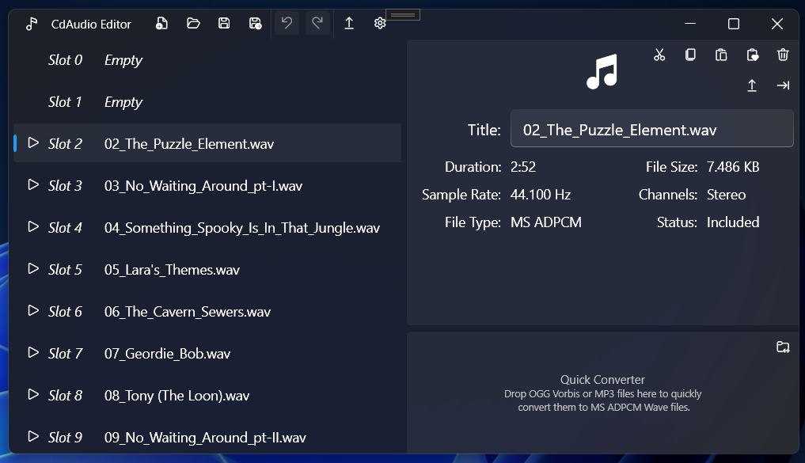
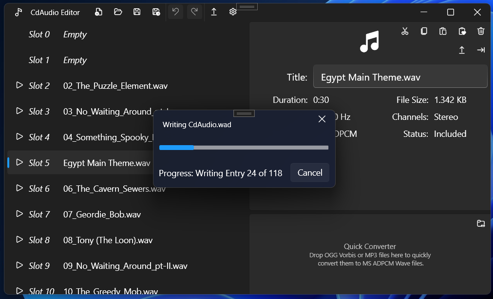

# CdAudioEdit

## Description
This app lets you open, edit, and save the CdAudio.wad for TR3's music. Extract .wav files from the Cdaudio.wad or compress wav, MP3, or OGG Vorbis files into the MS ADPCM Wave format used by TR3 and store them in the Cdaudio.wad. It also includes a converter to turn Wave, MP3, and OGG files into the correct MS ADPCM Wave File format for use in TR4 or TRC.
This is an early build, so there may be bugs. Although the size of the CdAudio.wad file can be very large, please make back-ups to prevent data loss.

## Installation
Download the latest release from [GitHub Releases](https://github.com/JohnnyJF10/CdAudioEdit/releases) and extract the files.

### Requirements
- Windows 10/11
- .NET 6+

## Usage
1. Open the app and load a CdAudio.wad file.

2. Use Drag and Drop or the Import Button to import new audio files (.wav, .mp3, .ogg (Vorbis)). You can reorder, shift, or rename the tracks as needed.

3. During file save, the injected audio files are converted and compressed to MS ADPCM, and the modified CdAudio.wad file is built.

Additional: 
- Use the Quick Converter to create MS ADPCM Wave Files 
- Use the Export tool to extract selected or all files in the CdAudio.wad to wav or MP3. 

### Keyboard Shortcuts
| Shortcut            | Action              |
|---------------------|--------------------|
| **Ctrl + N**       | New file           |
| **Ctrl + O**       | Open file          |
| **Ctrl + S**       | Save file          |
| **Ctrl + Shift + S** | Save As            |
| **Ctrl + X**       | Cut                |
| **Ctrl + C**       | Copy               |
| **Ctrl + V**       | Paste              |
| **Ctrl + D**       | Paste & Swap       |
| **Ctrl + Z**       | Undo               |
| **Ctrl + Y**       | Redo               |
| **Delete**         | Delete             |
| **Ctrl + E**       | Export             |
| **Ctrl + F**       | Open Settings      |

## License
This project is licensed under the MIT License.

### Third-Party Libraries
- [NAudio](https://github.com/naudio/NAudio) (MIT License)
- [NVorbis](https://github.com/NVorbis/NVorbis) (MIT License)
- [NAudio.Lame](https://github.com/Corey-M/NAudio.Lame) (MIT License)
- [wpfui](https://github.com/lepoco/wpfui) (MIT License)

## Contributing
Contributions are welcome! If you find a bug or have a feature request, please open an [issue](https://github.com/JohnnyJF10/CdAudioEdit/issues).  
If you want to contribute code, feel free to fork the repository and create a pull request.

## Support
If you have any issues, please open a [GitHub Issue](https://github.com/JohnnyJF10/CdAudioEdit/issues).  

## To Do List:
- Implement OGG Vorbis export (I could not find an appropriate .net encoder yet)
- Fix bugs
- Migrate from WPF to Win UI 3
